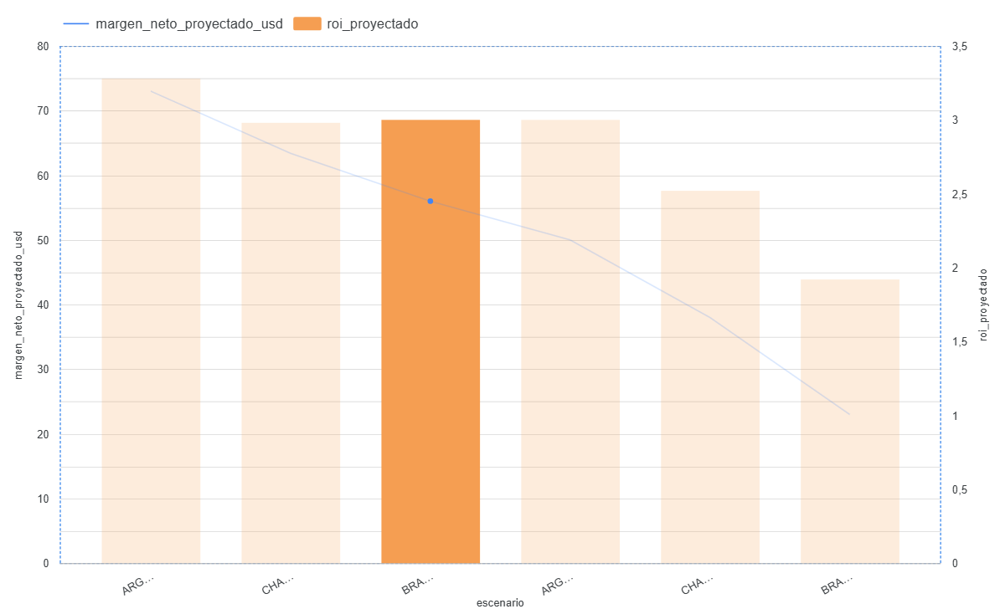

# Agro-Analytics Mercosur 2026 🌾 📊

### 📊 Dashboard Interactivo en Looker Studio

*📌 **Nota:** Hacé clic sobre la imagen superior para abrir el panel interactivo en vivo y filtrar los datos macroeconómicos por región.*

---

Proyecto interdisciplinario de modelado predictivo y análisis de datos enfocado en la evaluación del impacto económico y el Retorno de Inversión (ROI) del uso de bioinsumos bajo escenarios de estrés hídrico extremo en el Mercosur (Campaña 2026/27).

## 🚀 Presentación Ejecutiva Interactiva
Podés ver la presentación unificada (en Español y Portugués) con el motor de datos y el dashboard integrado en tiempo real ingresando acá:
👉 [Agro-Analytics Mercosur - Presentación Ejecutiva](https://garciahector-1.github.io/agro-analytics-mercado-bioinsumos/)

**Origen del Proyecto:** Desarrollado desde una perspectiva interdisciplinaria que fusiona las ciencias agrarias, el análisis de datos y la **biotecnología**. Como técnico agropecuario y estudiante avanzado de biotecnología, el objetivo central es cruzar datos macroeconómicos oficiales, registros meteorológicos históricos de la NASA y ensayos de respuesta biológica (fisiología y metabolismo vegetal) para diseñar estrategias comerciales eficientes y maximizar el Retorno de la Inversión (ROI) del productor ante escenarios de estrés climático extremo.

---

## 🛠️ Arquitectura y Tecnologías del Proyecto
* **Motor de Datos (SQL):** Procesamiento y cálculo de márgenes netos indexados, costos logísticos variables y proyecciones de rendimiento utilizando subconsultas avanzadas (CTEs) en PostgreSQL.
* **Visualización Avanzada (Looker Studio):** Dashboard dinámico interactivo con arquitectura de doble eje para correlacionar variables financieras de diferente escala: **Márgenes Netos (Eje Izquierdo en USD/ha)** vs. **Multiplicadores de ROI (Eje Derecho)**, optimizado mediante la consolidación de escenarios combinados en la fuente de datos.
* **Enfoque Biotecnológico/Agronómico:** Modelado de la respuesta fisiológica del cultivo ante eventos climáticos severos ("Niño Extremo" y "Niña / Secano") en tres ecorregiones clave: Zona Núcleo (Pergamino), Chaco (Chacabuco) y Brasil Cerrado (Mato Grosso).

## 📊 Principales Insights del Modelo (Mercosur)
1. **Logística Predictiva:** Ante alertas de "Niño Extremo" (suelos saturados que bloquean la maquinaria terrestre), el modelo activa una alerta de contratación preventiva de aviación agrícola (+USD 14/ha), defendiendo con éxito un potencial de +350 kg/ha en Zona Núcleo.
2. **Eficiencia de la Inversión:** El gráfico interactivo de doble eje demuestra que las mayores eficiencias de retorno (picos de ROI) se logran en los escenarios de "Niño Extremo" debido al fuerte diferencial de rendimiento que defienden los inductores foliares biológicos cuando el cultivo es protegido a tiempo.

---

## 🇧🇷 Análise de Cenários e Lógica de Negócios (Ecorregião Brasil Cerrado)

### 1. Cenário: BRASIL_CERRADO (MATO GROSSO) - NIÑO EXTREMO
* **Produtividade Projetada:** 3.600 kg/ha (Aumento de rendimento devido à alta pluviosidade, compensando a lixiviação com manejo biológico de solubilizadores de fósforo e fixadores de nitrogênio).
* **Preço de Venda Comercial:** USD 0,40 / kg (USD 400 por tonelada).
* **Faturamento Bruto Projetado:** USD 1.440,00 / ha.
* **Estrutura de Custos:**
  * Custo Base Indexado: USD 1.350,00 / ha.
  * Adicional de Logística Operativa por Excesso de Umidade: **USD 14,00 / ha** (Contratação preventiva de aviação agrícola devido à saturação severa do solo que impede a entrada de maquinário terrestre).
  * Custo Total Computado: USD 1.364,00 / ha.
* **Resultado Financeiro:**
  * **Margem Líquida Projetada:** **USD 76,00 / ha**
  * **Retorno do Investimento (ROI):** **3,28x** sobre o custo do pacote tecnológico aplicado.

### 2. Cenário: BRASIL_CERRADO (MATO GROSSO) - NIÑA / SECO
* **Produtividade Projetada:** 2.100 kg/ha (Quebra severa de rendimento causada pelo estresse hídrico prolongado e altas temperaturas).
* **Preço de Venda Comercial:** USD 0,43 / kg (Valorização de mercado por escassez regional).
* **Faturamento Bruto Projetado:** USD 903,00 / ha.
* **Estrutura de Custos:**
  * Custo Base Indexado: USD 840,00 / ha.
  * Adicional de Logística Operativa: **USD 0,00 / ha** (Condições secas que permitem aplicação terrestre convencional estável).
  * Custo Total Computado: USD 840,00 / ha.
* **Resultado Financeiro:**
  * **Margem Líquida Projetada:** **USD 63,00 / ha**
  * **Retorno do Investimento (ROI):** **2,98x** (Eficiência defensiva do bioinsumo ativa na proteção do teto produtivo mínimo).

---
---

## 📩 Contacto y Colaboración
Desarrollado por **Héctor García** - *Técnico Agropecuario y Analista de Datos*.

Si querés conocer más sobre el modelo, cruzamiento de datos climatológicos o discutir oportunidades en el sector Agrotech, podés contactarme en:
* **💼 LinkedIn:** [Héctor García](https://www.linkedin.com/in/h%C3%A9ctor-garc%C3%ADa-aa4687227/)
* **📩 Email:** [garciahector4toa@gmail.com](mailto:garciahector4toa@gmail.com)
* **💻 GitHub:** [garciahector-1](https://github.com/garciahector-1)
